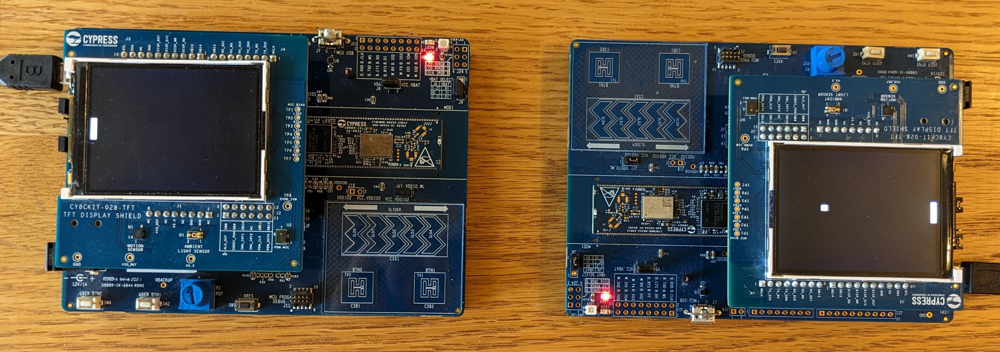

# psoc_pong

Two player pong game using the following kits:

- 2x CY8CKIT-062S2
- 2x CY8CKIT-028-TFT

Each kit has a TFT display thas shows a paddle. The paddle is controlled by the CAPSENSE
slider on the kit.

Bluetooth LE is used to send the ball back and forth between kits. One kit is
programmed as a Bluetooth Central and the other is programmed as a Bluetooth
Peripheral. The central automatically connects to the peripheral at power-up
by scanning for the Bluetooth device name of the peripheral (pong_peripheral).

The angle and speed of the ball after it hits a paddle is randomly changed.

A new game begins automatically as soon as one of the paddles fails to send the ball back.

Click the image below to see a video of the game being played:

